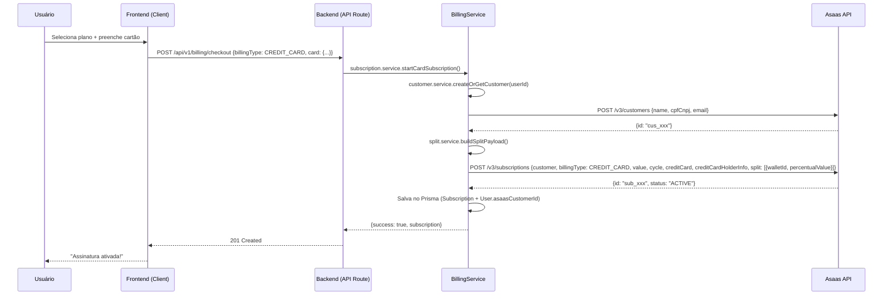
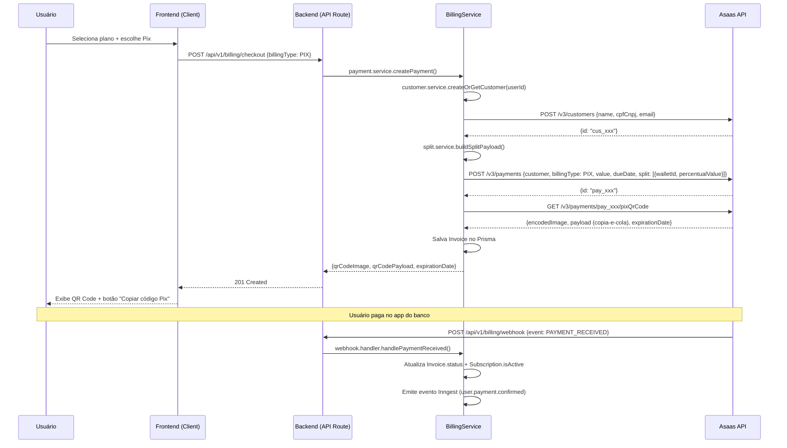
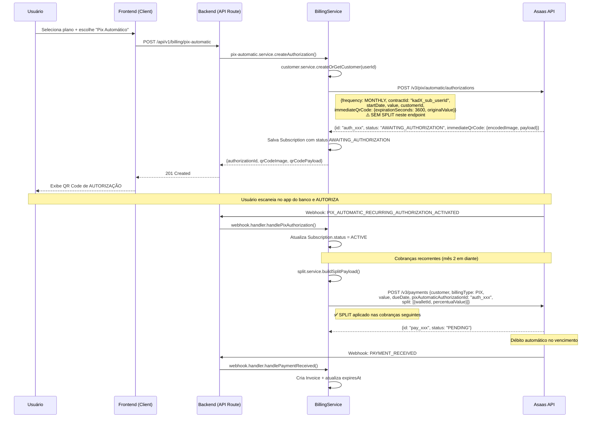

# PRD 01: Integração Ativa de Assinaturas (Asaas — Pix Automático, Cartão & Split)

## 1. Visão Geral

### Objetivo
Implementar um **Checkout Transparente** (dentro do Kadernim) utilizando a infraestrutura do Asaas. O objetivo é remover a dependência de plataformas externas de pagamento, reduzir o churn e oferecer a experiência de **Pix Automático** (recorrência nativa via Banco Central) e **Cartão de Crédito** com **Split de Pagamento** entre duas empresas.

### Problema Atual
- O sistema possui um webhook passivo (`/api/v1/enroll`) que foi criado como protótipo para receber confirmações de plataformas externas (Hotmart/Kiwifi).
- Não existe checkout transparente: o usuário sairia do domínio para pagar.
- Não há gestão de faturas, métodos de pagamento ou histórico de transações.
- Não há mecanismo de split para dividir receita entre empresas parceiras.
- A modelagem de banco é minimalista: `Subscription` (apenas `isActive`, `expiresAt`) e `ResourceUserAccess`.
- **O sistema está em desenvolvimento, sem clientes.** Os endpoints de enroll serão removidos e substituídos pela integração Asaas.

### Referência da Skill
**`nextjs-execution-guardrails`**: Toda a implementação seguirá rigorosamente os guardrails. Páginas read-heavy serão Server Components, lógica interativa ficará em Client Components filhos, e nenhuma query Prisma existirá dentro das rotas de API.

---

## 2. Estado Atual do Domínio Billing

### 2.1. Tabelas existentes no Prisma

| Model | Campos principais | Observações |
|---|---|---|
| `Subscription` | `id`, `userId`, `isActive`, `purchaseDate`, `expiresAt` | Sem vínculo com gateway externo |
| `ResourceUserAccess` | `userId`, `resourceId`, `source`, `expiresAt` | Controla acesso individual por recurso |

### 2.2. Rotas de API existentes (a serem REMOVIDAS)

| Rota | Método | Descrição | Ação |
|---|---|---|---|
| `/api/v1/enroll` | POST | Protótipo: recebia pagamento externo e concedia acesso | ❌ **REMOVER** |
| `/api/v1/enroll/subscriber` | POST | Protótipo: ativava assinatura via webhook externo | ❌ **REMOVER** |

### 2.3. Schemas existentes (a serem REMOVIDOS)

| Arquivo | Conteúdo | Ação |
|---|---|---|
| `src/schemas/billing/enroll-schemas.ts` | `EnrollmentPayloadSchema` | ❌ **REMOVER** junto com a rota |

### 2.4. Services existentes

Nenhum. O `BillingService` está listado como **Pendente** no PRD 02.

### 2.5. Componentes de UI existentes

Nenhum. Não existe página de billing no dashboard.

---

## 3. Arquitetura Técnica

### 3.1. Estrutura de Diretórios (Target)

```
src/
├── services/
│   └── billing/
│       ├── asaas-client.ts           # Cliente HTTP configurado (base URL, auth, error handling)
│       ├── customer.service.ts        # CRUD de clientes no Asaas
│       ├── subscription.service.ts    # Criar/cancelar/buscar assinaturas
│       ├── payment.service.ts         # Criar cobranças avulsas, buscar QR Code Pix
│       ├── pix-automatic.service.ts   # Autorizações de Pix Automático
│       ├── split.service.ts           # Configuração e consulta de splits
│       └── webhook.handler.ts         # Mapeia eventos Asaas → ações Prisma
│
├── schemas/
│   └── billing/
│       ├── customer-schemas.ts        # Validação de criação/atualização de Customer
│       ├── subscription-schemas.ts    # Validação de criação de Subscription
│       ├── payment-schemas.ts         # Validação de criação de Payment
│       ├── split-schemas.ts           # Validação de configuração de split
│       └── webhook-schemas.ts         # Validação do payload do webhook Asaas
│
├── types/
│   └── billing/
│       ├── customer.ts                # Tipo local do BillingCustomer
│       ├── subscription.ts            # Tipo local da Subscription (com dados Asaas)
│       ├── invoice.ts                 # Tipo local da Invoice
│       ├── split-config.ts            # Tipo da configuração de split (admin)
│       └── webhook-event.ts           # Tipo dos eventos do webhook Asaas
│
├── components/
│   └── dashboard/
│       └── billing/
│           ├── checkout-form.tsx       # Client: Formulário de checkout (Cartão + Pix)
│           ├── credit-card-form.tsx    # Client: Campos de cartão com tokenização
│           ├── pix-qr-code.tsx         # Client: Exibição do QR Code + copia-e-cola
│           ├── pix-automatic-auth.tsx  # Client: QR Code de autorização do Pix Automático
│           ├── subscription-status.tsx # Client: Card com status da assinatura
│           ├── invoice-list.tsx        # Client: Tabela de faturas
│           ├── payment-method-card.tsx # Client: Exibição do método de pagamento atual
│           └── split-config-form.tsx   # Client: (Admin) Formulário de configuração de split
│
├── app/
│   ├── (client)/
│   │   └── billing/
│   │       └── page.tsx               # Server Component: Página de billing do cliente
│   ├── admin/
│   │   └── billing/
│   │       └── page.tsx               # Server Component: Gestão de billing (admin)
│   │       └── split/
│   │           └── page.tsx           # Server Component: Configuração de split (admin)
│   └── api/v1/
│       └── billing/
│           ├── checkout/route.ts      # POST: Iniciar pagamento (cartão ou pix)
│           ├── subscriptions/route.ts # GET: Listar assinaturas do usuário
│           ├── subscriptions/[id]/route.ts # DELETE: Cancelar assinatura
│           ├── pix-automatic/
│           │   └── route.ts           # POST: Criar autorização de Pix Automático
│           ├── split/
│           │   └── route.ts           # GET/PUT: Configuração de split (admin)
│           └── webhook/
│               └── route.ts           # POST: Receber eventos do Asaas
```

### 3.2. Variáveis de Ambiente

| Variável | Descrição | Obrigatória |
|---|---|---|
| `ASAAS_API_KEY` | Chave de API do Asaas (sandbox ou produção) | ✅ |
| `ASAAS_BASE_URL` | `https://sandbox.asaas.com/api` ou `https://api.asaas.com/api` | ✅ |
| `ASAAS_WEBHOOK_TOKEN` | Token para validar autenticidade dos webhooks | ✅ |
| `ASAAS_SPLIT_WALLET_ID` | WalletId da conta secundária (empresa parceira) | ✅ |
| `ASAAS_SPLIT_PERCENTAGE` | Percentual padrão do split (default, pode ser sobrescrito via admin) | ⚠️ Fallback |

---

## 4. Modelagem de Dados (Prisma)

### 4.1. Alterações no model `Subscription`

```prisma
model Subscription {
  id     String @id @default(cuid())
  userId String @unique
  user   User   @relation(fields: [userId], references: [id], onDelete: Cascade)

  // Campos existentes
  isActive     Boolean   @default(true)
  purchaseDate DateTime  @default(now())
  expiresAt    DateTime?

  // Novos campos — Integração Asaas
  asaasCustomerId       String?   // ID do customer no Asaas
  asaasSubscriptionId   String?   @unique  // ID da subscription no Asaas
  asaasPaymentMethod    PaymentMethod?      // Método de pagamento
  status                SubscriptionStatus @default(INACTIVE)

  // Dados do cartão (apenas para exibição, NUNCA dados sensíveis)
  cardLast4   String?
  cardBrand   String?

  // Controle de recorrência
  nextBillingDate  DateTime?
  canceledAt       DateTime?
  cancelReason     String?

  // Pix Automático
  pixAutomaticAuthorizationId String? @unique

  @@index([userId])
  @@index([asaasCustomerId])
  @@index([status])
  @@index([isActive])
  @@index([expiresAt])
  @@map("subscription")
}

enum PaymentMethod {
  CREDIT_CARD
  PIX
  PIX_AUTOMATIC
}

enum SubscriptionStatus {
  ACTIVE                  // Pagamento em dia
  OVERDUE                 // Pagamento atrasado
  CANCELED                // Cancelada pelo usuário ou admin
  INACTIVE                // Nunca ativada ou expirada
  AWAITING_AUTHORIZATION  // Pix Automático: aguardando autorização do banco
}
```

### 4.2. Novo model `Invoice`

```prisma
model Invoice {
  id     String @id @default(cuid())
  userId String
  user   User   @relation(fields: [userId], references: [id], onDelete: Cascade)

  asaasPaymentId  String   @unique  // ID do payment no Asaas
  status          InvoiceStatus @default(PENDING)
  billingType     PaymentMethod
  value           Float
  netValue        Float?          // Valor líquido (após taxas)
  description     String?
  dueDate         DateTime
  paidAt          DateTime?
  refundedAt      DateTime?
  invoiceUrl      String?         // Link do boleto/fatura
  pixQrCodeUrl    String?         // URL da imagem do QR Code
  pixCopyPaste    String?         // Código Pix copia-e-cola

  // Split
  splitWalletId         String?
  splitFixedValue       Float?
  splitPercentualValue  Float?

  createdAt DateTime @default(now())
  updatedAt DateTime @updatedAt

  @@index([userId])
  @@index([status])
  @@index([dueDate])
  @@index([asaasPaymentId])
  @@map("invoice")
}

enum InvoiceStatus {
  PENDING
  CONFIRMED
  RECEIVED
  OVERDUE
  REFUNDED
  REFUND_REQUESTED
  CHARGEBACK_REQUESTED
  CHARGEBACK_DISPUTE
  AWAITING_CHARGEBACK_REVERSAL
  DUNNING_REQUESTED
  DUNNING_RECEIVED
  AWAITING_RISK_ANALYSIS
}
```

### 4.3. Novo model `SplitConfig`

```prisma
model SplitConfig {
  id     String @id @default(cuid())

  // Identificação da empresa parceira
  companyName       String        // Nome da empresa parceira
  companyCnpj       String?       // CNPJ da empresa parceira
  walletId          String @unique // WalletId da conta Asaas da parceira

  // Regras de split
  splitType         SplitType @default(PERCENTAGE)
  percentualValue   Float?        // Percentual do valor líquido (ex: 30.0 = 30%)
  fixedValue        Float?        // Valor fixo por transação (alternativa ao percentual)

  // Metadata
  isActive    Boolean  @default(true)
  description String?
  createdAt   DateTime @default(now())
  updatedAt   DateTime @updatedAt

  @@map("split_config")
}

enum SplitType {
  PERCENTAGE
  FIXED
}
```

### 4.4. Alterações no model `User`

```prisma
model User {
  // ... campos existentes ...

  // Novo campo
  asaasCustomerId String? @unique  // ID do customer no Asaas

  // Nova relação
  invoices Invoice[]
}
```

---

## 5. Inventário Completo de Arquivos Afetados

### 5.1. Arquivos a CRIAR

| Arquivo | Tipo | Descrição |
|---|---|---|
| `src/services/billing/asaas-client.ts` | Service | Cliente HTTP base (headers, base URL, error handling) |
| `src/services/billing/customer.service.ts` | Service | `createOrGetCustomer(userId)`, `syncCustomer(userId)` |
| `src/services/billing/subscription.service.ts` | Service | `startCardSubscription()`, `startPixSubscription()`, `cancelSubscription()`, `getSubscription()` |
| `src/services/billing/payment.service.ts` | Service | `createPayment()`, `getPixQrCode(paymentId)`, `listPayments()` |
| `src/services/billing/pix-automatic.service.ts` | Service | `createAuthorization()`, `getAuthorization()`, `cancelAuthorization()` |
| `src/services/billing/split.service.ts` | Service | `getSplitConfig()`, `updateSplitConfig()`, `buildSplitPayload()` |
| `src/services/billing/webhook.handler.ts` | Service | Mapeamento de eventos → ações no banco |
| `src/schemas/billing/customer-schemas.ts` | Schema | `CustomerCreateSchema`, `CustomerUpdateSchema` |
| `src/schemas/billing/subscription-schemas.ts` | Schema | `SubscriptionCreateSchema`, `CheckoutSchema` |
| `src/schemas/billing/payment-schemas.ts` | Schema | `PaymentCreateSchema`, `PixQrCodeSchema` |
| `src/schemas/billing/split-schemas.ts` | Schema | `SplitConfigSchema`, `SplitUpdateSchema` |
| `src/schemas/billing/webhook-schemas.ts` | Schema | `AsaasWebhookPayloadSchema` |
| `src/types/billing/customer.ts` | Type | `BillingCustomer` interface |
| `src/types/billing/subscription.ts` | Type | `BillingSubscription` interface |
| `src/types/billing/invoice.ts` | Type | `BillingInvoice` interface |
| `src/types/billing/split-config.ts` | Type | `SplitConfig` interface |
| `src/types/billing/webhook-event.ts` | Type | `AsaasWebhookEvent` enum + interfaces |
| `src/components/dashboard/billing/checkout-form.tsx` | Component (Client) | Formulário principal de checkout |
| `src/components/dashboard/billing/credit-card-form.tsx` | Component (Client) | Campos de cartão + tokenização |
| `src/components/dashboard/billing/pix-qr-code.tsx` | Component (Client) | QR Code Pix + código copia-e-cola |
| `src/components/dashboard/billing/pix-automatic-auth.tsx` | Component (Client) | QR Code de autorização Pix Automático |
| `src/components/dashboard/billing/subscription-status.tsx` | Component (Client) | Card de status da assinatura |
| `src/components/dashboard/billing/invoice-list.tsx` | Component (Client) | Tabela de faturas/histórico |
| `src/components/dashboard/billing/payment-method-card.tsx` | Component (Client) | Exibição do método atual (cartão final XXXX) |
| `src/components/dashboard/billing/split-config-form.tsx` | Component (Client) | Admin: Formulário de split |
| `src/app/(client)/billing/page.tsx` | Page (Server) | Página de billing do cliente |
| `src/app/admin/billing/page.tsx` | Page (Server) | Gestão de billing (admin) |
| `src/app/admin/billing/split/page.tsx` | Page (Server) | Configuração de split (admin) |
| `src/app/api/v1/billing/checkout/route.ts` | API | POST: Iniciar pagamento |
| `src/app/api/v1/billing/subscriptions/route.ts` | API | GET: Listar assinaturas |
| `src/app/api/v1/billing/subscriptions/[id]/route.ts` | API | DELETE: Cancelar assinatura |
| `src/app/api/v1/billing/pix-automatic/route.ts` | API | POST: Criar autorização Pix Automático |
| `src/app/api/v1/billing/split/route.ts` | API | GET/PUT: Config de split |
| `src/app/api/v1/billing/webhook/route.ts` | API | POST: Webhook do Asaas |
| `src/services/billing/audit.service.ts` | Service | `log()`, `isDuplicate()`, `getTimeline()` |
| `src/services/billing/logger.ts` | Service | `billingLog()` — logging estruturado JSON |
| `src/types/billing/audit.ts` | Type | `BillingAuditLog` interface + `AuditActor` enum |
| `src/components/dashboard/billing/audit-timeline.tsx` | Component (Client) | Timeline de auditoria com filtros |
| `src/app/admin/billing/audit/page.tsx` | Page (Server) | Audit trail (admin) |

### 5.2. Arquivos a ALTERAR

| `prisma/schema.prisma` | Adicionar `Invoice`, `SplitConfig`, `BillingAuditLog`, enums, e campos novos em `Subscription` e `User` |
| `src/lib/db.ts` | Adicionar Prisma middleware de logging para domínio billing |
| `src/app/(client)/layout.tsx` | Adicionar link para `/billing` na sidebar |
| `src/app/admin/layout.tsx` | Adicionar link para `/admin/billing` na sidebar admin |
| `.env.local` | Adicionar variáveis: `ASAAS_API_KEY`, `ASAAS_BASE_URL`, `ASAAS_WEBHOOK_TOKEN`, `ASAAS_SPLIT_WALLET_ID` |

### 5.3. Arquivos a REMOVER

| Arquivo | Motivo |
|---|---|
| `src/app/api/v1/enroll/route.ts` | Substituído pelo checkout transparente via Asaas |
| `src/app/api/v1/enroll/subscriber/route.ts` | Substituído pela lógica de subscription via Asaas |
| `src/schemas/billing/enroll-schemas.ts` | Schema do endpoint removido |

---

## 6. Detalhamento dos Fluxos

### 6.1. Fluxo: Checkout Transparente — Cartão de Crédito



**Dados necessários do frontend para Cartão:**

| Campo | Tipo | Obrigatório | Descrição |
|---|---|---|---|
| `holderName` | string | ✅ | Nome impresso no cartão |
| `number` | string | ✅ | Número do cartão |
| `expiryMonth` | string | ✅ | Mês de expiração (2 dígitos) |
| `expiryYear` | string | ✅ | Ano de expiração (4 dígitos) |
| `ccv` | string | ✅ | Código de segurança |
| `cpfCnpj` | string | ✅ | CPF ou CNPJ do titular |
| `postalCode` | string | ✅ | CEP do titular |
| `addressNumber` | string | ✅ | Número do endereço do titular |
| `phone` | string | ✅ | Telefone do titular |
| `email` | string | ✅ | Email do titular |
| `remoteIp` | string | ✅ (capturado no backend) | IP do usuário |

### 6.2. Fluxo: Checkout Transparente — Pix (Cobrança Avulsa)



### 6.3. Fluxo: Pix Automático (Recorrência Nativa do Banco Central)

> **⚠️ LIMITAÇÃO DE SPLIT NO PIX AUTOMÁTICO**
>
> O split **NÃO é compatível** com a criação da autorização Pix Automático (`POST /v3/pix/automatic/authorizations`).
> Isso significa que a **primeira cobrança** (o `immediateQrCode` gerado junto com a autorização) **vai 100% para a conta principal** (sem split).
>
> Porém, as **cobranças recorrentes subsequentes** são criadas via `POST /v3/payments` com `pixAutomaticAuthorizationId`, e nesse endpoint o **split funciona normalmente**.
>
> **Impacto prático**: A primeira mensalidade não será dividida. A partir da segunda, o split será aplicado conforme configurado.



**Campos do POST `/v3/pix/automatic/authorizations`:**

| Campo | Tipo | Obrigatório | Descrição |
|---|---|---|---|
| `frequency` | enum | ✅ | `WEEKLY`, `MONTHLY`, `QUARTERLY`, `SEMIANNUALLY`, `ANNUALLY` |
| `contractId` | string (max 35) | ✅ | Identificador único do contrato (ex: `kadX_{userId}`) |
| `startDate` | date | ✅ | Data de início da autorização |
| `finishDate` | date | ❌ | Data final (omitir = vigência indeterminada) |
| `value` | number | ❌* | Valor fixo periódico (*obrigatório se não usar `minLimitValue`) |
| `description` | string (max 35) | ❌ | Descrição curta |
| `customerId` | string | ✅ | ID do customer no Asaas |
| `immediateQrCode.expirationSeconds` | int | ✅ | Expiração do QR Code inicial (ex: 3600) |
| `immediateQrCode.originalValue` | number | ✅ | Valor da primeira cobrança |
| `immediateQrCode.description` | string | ❌ | Descrição da primeira cobrança |

**Campos do POST `/v3/payments` (cobranças recorrentes com Pix Automático + Split):**

| Campo | Tipo | Obrigatório | Descrição |
|---|---|---|---|
| `customer` | string | ✅ | ID do customer no Asaas |
| `billingType` | enum | ✅ | `PIX` |
| `value` | number | ✅ | Valor da cobrança |
| `dueDate` | date | ✅ | Data de vencimento |
| `pixAutomaticAuthorizationId` | string | ✅ | ID da autorização Pix Automático |
| `split` | array | ❌ | Array de split (walletId + percentualValue ou fixedValue) |
| `description` | string | ❌ | Descrição da cobrança |

---

## 7. Split de Pagamento — Detalhamento

### 7.1. Como funciona o Split no Asaas

O split é configurado **por cobrança** ou **por assinatura**. Ao criar um `payment` ou `subscription`, enviamos o array `split` com:

```json
{
  "split": [
    {
      "walletId": "wallet_xxxxxxx",        // WalletId da conta secundária
      "percentualValue": 30.0,              // 30% do valor líquido
      "description": "Parceria Empresa X"
    }
  ]
}
```

**Regras importantes:**
- O `walletId` é obtido via GET `/v3/wallets/` na conta da empresa parceira.
- O `percentualValue` é aplicado sobre o **valor líquido** (após taxas do Asaas).
- Alternativamente, pode-se usar `fixedValue` para um valor fixo por transação.
- Splits são processados automaticamente quando o pagamento é confirmado.
- É possível consultar splits pagos via GET `/v3/payments/splits/paid` e recebidos via `/v3/payments/splits/received`.

**Compatibilidade de Split por método de pagamento:**

| Método | Suporta Split na Criação? | Observação |
|---|---|---|
| Cartão de Crédito (Subscription) | ✅ Sim | `POST /v3/subscriptions` aceita `split[]` |
| Pix Avulso (Payment) | ✅ Sim | `POST /v3/payments` aceita `split[]` |
| Pix Automático (Autorização) | ❌ Não | `POST /v3/pix/automatic/authorizations` **não aceita** `split[]` |
| Pix Automático (Cobranças seguintes) | ✅ Sim | `POST /v3/payments` com `pixAutomaticAuthorizationId` aceita `split[]` |

> **Decisão de produto**: A primeira cobrança do Pix Automático (immediateQrCode) vai 100% para a conta principal. A partir da segunda cobrança, o split é aplicado normalmente. Essa limitação deve ser comunicada ao admin na UI de configuração do split.

### 7.2. Interface Admin: Configuração de Split

**Página: `/admin/billing/split`** (Server Component)

| Campo na UI | Tipo | Validação | Descrição |
|---|---|---|---|
| Nome da Empresa Parceira | Input text | min 3 chars | Nome comercial para identificação |
| CNPJ | Input masked | Validação de CNPJ | Documento da empresa parceira |
| Wallet ID (Asaas) | Input text | Obrigatório, formato `wallet_xxx` | Identificador da carteira Asaas |
| Tipo de Split | Select | `PERCENTAGE` ou `FIXED` | Define se o split é percentual ou valor fixo |
| Percentual (%) | Input number | 0.01–99.99 | Percentual do valor líquido (se tipo = PERCENTAGE) |
| Valor Fixo (R$) | Input number | > 0 | Valor fixo por transação (se tipo = FIXED) |
| Descrição | Textarea | max 200 chars | Observações internas |
| Ativo | Switch | Boolean | Habilita/desabilita o split |

**Comportamento:**
- O admin configura os dados do split **uma vez**.
- A configuração é salva na tabela `SplitConfig`.
- Ao criar qualquer pagamento ou assinatura, o `BillingService` lê o `SplitConfig` ativo e monta o array `split` automaticamente.
- Se o split estiver desativado (`isActive: false`), os pagamentos são criados sem split.
- O admin pode alterar o percentual/valor a qualquer momento; mudanças afetam apenas **cobranças futuras**.

### 7.3. Fluxo Split no Código

```typescript
// src/services/billing/split.service.ts

export class SplitService {
  static async getActiveConfig(): Promise<SplitConfig | null> {
    return prisma.splitConfig.findFirst({
      where: { isActive: true }
    })
  }

  static async buildSplitPayload(): Promise<AsaasSplitDTO[] | undefined> {
    const config = await this.getActiveConfig()
    if (!config) return undefined

    return [{
      walletId: config.walletId,
      ...(config.splitType === 'PERCENTAGE'
        ? { percentualValue: config.percentualValue }
        : { fixedValue: config.fixedValue }
      ),
      description: config.description || `Split ${config.companyName}`
    }]
  }

  static async updateConfig(data: SplitConfigUpdate): Promise<SplitConfig> {
    // Desativa todas as configs anteriores
    await prisma.splitConfig.updateMany({
      where: { isActive: true },
      data: { isActive: false }
    })
    // Cria nova config ativa
    return prisma.splitConfig.create({ data: { ...data, isActive: true } })
  }
}
```

---

## 8. Webhook — Mapeamento de Eventos

### 8.1. Endpoint: `POST /api/v1/billing/webhook`

```typescript
// Padrão Guardrails: auth → validate → delegate → respond
export async function POST(request: NextRequest) {
  // 1. Validar token do webhook
  const token = request.headers.get('asaas-access-token')
  if (token !== process.env.ASAAS_WEBHOOK_TOKEN) {
    return NextResponse.json({ error: 'Unauthorized' }, { status: 401 })
  }

  // 2. Validar payload
  const body = await request.json()
  const parsed = AsaasWebhookPayloadSchema.safeParse(body)
  if (!parsed.success) {
    return NextResponse.json({ error: 'Invalid payload' }, { status: 400 })
  }

  // 3. Delegar para o handler
  await WebhookHandler.process(parsed.data)

  // 4. Responder
  return NextResponse.json({ received: true }, { status: 200 })
}
```

### 8.2. Eventos de Cobrança (Payment)

| Evento Asaas | Prioridade | Ação no Sistema |
|---|---|---|
| `PAYMENT_CREATED` | Info | Cria `Invoice` local com status `PENDING`. Registra `BillingAuditLog`. |
| `PAYMENT_UPDATED` | Info | Atualiza `Invoice.dueDate` ou `Invoice.value`. Registra audit. |
| `PAYMENT_CONFIRMED` | Alta | Atualiza `Invoice.status = CONFIRMED`. |
| `PAYMENT_RECEIVED` | **Crítica** | Atualiza `Invoice.status = RECEIVED`, `paidAt = now()`, `netValue`. Se vinculado a Subscription, atualiza `expiresAt` e `isActive = true`. Emite Inngest `user.payment.confirmed`. Registra audit. |
| `PAYMENT_OVERDUE` | Alta | Atualiza `Invoice.status = OVERDUE`. Emite Inngest `user.payment.overdue` (dispara template de atraso). Registra audit. |
| `PAYMENT_REFUNDED` | **Crítica** | Atualiza `Invoice.status = REFUNDED`, `refundedAt = now()`. Se vinculado a Subscription, atualiza `isActive = false`. Emite Inngest `user.payment.refunded`. Registra audit. |
| `PAYMENT_PARTIALLY_REFUNDED` | Alta | Atualiza `Invoice.status = REFUNDED`, registra valor parcial no audit. |
| `PAYMENT_REFUND_IN_PROGRESS` | Info | Atualiza `Invoice.status = REFUND_REQUESTED`. |
| `PAYMENT_REFUND_DENIED` | Alta | Mantém status anterior. Notifica admin via Inngest. Registra audit com motivo. |
| `PAYMENT_DELETED` | Média | Soft delete do `Invoice` local. Registra audit. |
| `PAYMENT_RESTORED` | Média | Restaura `Invoice` soft-deleted. |
| `PAYMENT_AWAITING_RISK_ANALYSIS` | Info | Atualiza `Invoice.status = AWAITING_RISK_ANALYSIS`. |
| `PAYMENT_APPROVED_BY_RISK_ANALYSIS` | Info | Processamento segue normalmente. |
| `PAYMENT_REPROVED_BY_RISK_ANALYSIS` | Alta | Atualiza `Invoice.status = PENDING`. Notifica admin. |
| `PAYMENT_CREDIT_CARD_CAPTURE_REFUSED` | Alta | Registra falha no audit. Notifica usuário com erro amigável. |
| `PAYMENT_CHARGEBACK_REQUESTED` | **Crítica** | Atualiza `Invoice.status = CHARGEBACK_REQUESTED`. Bloqueia acesso. Notifica admin via Inngest. Registra audit. |
| `PAYMENT_CHARGEBACK_DISPUTE` | Alta | Atualiza `Invoice.status = CHARGEBACK_DISPUTE`. |
| `PAYMENT_AWAITING_CHARGEBACK_REVERSAL` | Alta | Atualiza `Invoice.status = AWAITING_CHARGEBACK_REVERSAL`. |
| `PAYMENT_DUNNING_REQUESTED` | Média | Atualiza `Invoice.status = DUNNING_REQUESTED`. |
| `PAYMENT_DUNNING_RECEIVED` | Média | Atualiza `Invoice.status = DUNNING_RECEIVED`. |
| `PAYMENT_CHECKOUT_VIEWED` | Info | Log apenas (não altera estado). |
| `PAYMENT_BANK_SLIP_VIEWED` | Info | Log apenas (não altera estado). |
| `PAYMENT_SPLIT_CANCELLED` | Alta | Registra no audit. Notifica admin. |
| `PAYMENT_SPLIT_DIVERGENCE_BLOCK` | Alta | Registra no audit. Notifica admin. |
| `PAYMENT_SPLIT_DIVERGENCE_BLOCK_FINISHED` | Info | Registra no audit. |

### 8.3. Eventos de Assinatura (Subscription)

| Evento Asaas | Prioridade | Ação no Sistema |
|---|---|---|
| `SUBSCRIPTION_CREATED` | Info | Registra audit. |
| `SUBSCRIPTION_RENEWED` | Alta | Cria novo `Invoice` no Prisma. Atualiza `nextBillingDate`. Registra audit. |
| `SUBSCRIPTION_DELETED` | **Crítica** | Atualiza `Subscription.status = CANCELED`, `canceledAt = now()`. Mantém acesso até `expiresAt`. Registra audit. |

### 8.4. Eventos de Pix Automático

| Evento Asaas | Prioridade | Ação no Sistema |
|---|---|---|
| `PIX_AUTOMATIC_RECURRING_AUTHORIZATION_CREATED` | Info | Registra audit com `authorizationId`. |
| `PIX_AUTOMATIC_RECURRING_AUTHORIZATION_ACTIVATED` | **Crítica** | Atualiza `Subscription.status = ACTIVE`. Emite Inngest `user.subscription.activated`. Registra audit. |
| `PIX_AUTOMATIC_RECURRING_AUTHORIZATION_CANCELLED` | **Crítica** | Atualiza `Subscription.status = CANCELED`. Registra audit. |
| `PIX_AUTOMATIC_RECURRING_AUTHORIZATION_EXPIRED` | Alta | Atualiza `Subscription.status = INACTIVE`. Notifica usuário. Registra audit. |
| `PIX_AUTOMATIC_RECURRING_AUTHORIZATION_REFUSED` | Alta | Atualiza `Subscription.status = INACTIVE`. Notifica usuário com erro amigável. Registra audit. |
| `PIX_AUTOMATIC_RECURRING_PAYMENT_INSTRUCTION_CREATED` | Info | Registra audit. |
| `PIX_AUTOMATIC_RECURRING_PAYMENT_INSTRUCTION_SCHEDULED` | Info | Registra audit. |
| `PIX_AUTOMATIC_RECURRING_PAYMENT_INSTRUCTION_REFUSED` | Alta | Notifica admin + usuário. Registra audit com motivo. |
| `PIX_AUTOMATIC_RECURRING_PAYMENT_INSTRUCTION_CANCELLED` | Alta | Registra audit. |
| `PIX_AUTOMATIC_RECURRING_ELIGIBILITY_UPDATED` | Info | Log para subcontas. |

### 8.5. Resiliência do Webhook

**Regras de implementação:**
- O webhook **DEVE** retornar `200` o mais rápido possível, mesmo que o processamento falhe.
- Processar o payload via **Inngest** (fila assíncrona) para evitar timeouts.
- Implementar **idempotency guard** usando o `id` do evento Asaas (campo `id` do webhook payload).
- O código **DEVE** estar preparado para receber novos campos não mapeados sem quebrar (Asaas adiciona atributos sem aviso).
- Usar `z.passthrough()` no Zod schema para não rejeitar campos desconhecidos.

```typescript
// Idempotency guard
const existing = await prisma.billingAuditLog.findFirst({
  where: { asaasEventId: event.id }
})
if (existing) {
  return NextResponse.json({ received: true, deduplicated: true }, { status: 200 })
}
```

---

## 9. Auditoria, Logging & Observabilidade

> **Princípio**: Toda mutação financeira deve ser rastreável. Cada ação de billing — seja originada pelo usuário, admin, webhook ou cron — deve gerar um registro de auditoria imutável.

### 9.1. Novo model `BillingAuditLog`

```prisma
model BillingAuditLog {
  id     String @id @default(cuid())

  // Quem
  userId    String?   // Null se for ação do sistema (webhook/cron)
  actor     AuditActor @default(SYSTEM)

  // O quê
  action    String     // Ex: "PAYMENT_RECEIVED", "SUBSCRIPTION_CREATED", "SPLIT_CONFIG_UPDATED"
  entity    String     // Ex: "Invoice", "Subscription", "SplitConfig"
  entityId  String     // ID da entidade afetada

  // Contexto
  asaasEventId     String?  @unique  // ID do evento Asaas (idempotency)
  asaasPaymentId   String?           // Referência cruzada
  previousState    Json?             // Snapshot do estado anterior (para reversão/auditoria)
  newState         Json?             // Snapshot do novo estado
  metadata         Json?             // Dados extras (IP, user-agent, erro, motivo)

  createdAt DateTime @default(now())

  @@index([userId])
  @@index([action])
  @@index([entity, entityId])
  @@index([asaasEventId])
  @@index([createdAt])
  @@map("billing_audit_log")
}

enum AuditActor {
  USER       // Ação do próprio usuário (cancelar assinatura, trocar cartão)
  ADMIN      // Ação do admin (configurar split, cancelar manual)
  SYSTEM     // Webhook do Asaas ou cron job
}
```

### 9.2. Funções de Auditoria no Service

```typescript
// src/services/billing/audit.service.ts

export class BillingAuditService {
  static async log(params: {
    userId?: string
    actor: AuditActor
    action: string
    entity: string
    entityId: string
    asaasEventId?: string
    asaasPaymentId?: string
    previousState?: Record<string, unknown>
    newState?: Record<string, unknown>
    metadata?: Record<string, unknown>
  }) {
    return prisma.billingAuditLog.create({ data: params })
  }

  static async isDuplicate(asaasEventId: string): Promise<boolean> {
    const existing = await prisma.billingAuditLog.findUnique({
      where: { asaasEventId }
    })
    return !!existing
  }

  static async getTimeline(params: {
    userId?: string
    entity?: string
    entityId?: string
    limit?: number
  }) {
    return prisma.billingAuditLog.findMany({
      where: {
        ...(params.userId && { userId: params.userId }),
        ...(params.entity && { entity: params.entity }),
        ...(params.entityId && { entityId: params.entityId }),
      },
      orderBy: { createdAt: 'desc' },
      take: params.limit || 50,
    })
  }
}
```

### 9.3. Exemplos de Registro de Auditoria

| Cenário | `action` | `actor` | `entity` | `previousState` | `newState` |
|---|---|---|---|---|---|
| Webhook: Pagamento recebido | `PAYMENT_RECEIVED` | `SYSTEM` | `Invoice` | `{status: "PENDING"}` | `{status: "RECEIVED", paidAt: "..."}` |
| Admin altera split de 30% para 40% | `SPLIT_CONFIG_UPDATED` | `ADMIN` | `SplitConfig` | `{percentualValue: 30}` | `{percentualValue: 40}` |
| Usuário cancela assinatura | `SUBSCRIPTION_CANCELLED` | `USER` | `Subscription` | `{status: "ACTIVE"}` | `{status: "CANCELED"}` |
| Webhook: Chargeback recebido | `CHARGEBACK_REQUESTED` | `SYSTEM` | `Invoice` | `{status: "RECEIVED"}` | `{status: "CHARGEBACK_REQUESTED"}` |
| Webhook duplicado rejeitado | — | — | — | — | Retorna 200 sem processar |

### 9.4. Prisma Query Logging (Middleware)

```typescript
// src/lib/db.ts — adicionar ao singleton do Prisma

prisma.$use(async (params, next) => {
  // Log apenas queries do domínio billing em ambiente de desenvolvimento
  if (
    process.env.NODE_ENV === 'development' &&
    ['Invoice', 'Subscription', 'SplitConfig', 'BillingAuditLog'].includes(
      params.model ?? ''
    )
  ) {
    const before = Date.now()
    const result = await next(params)
    const after = Date.now()
    console.info(
      `[Prisma:Billing] ${params.model}.${params.action} — ${after - before}ms`
    )
    return result
  }
  return next(params)
})
```

### 9.5. Structured Logging (Produção)

Em produção, logs financeiros devem usar **JSON estruturado** para busca em ferramentas como Axiom, Datadog ou Vercel Logs:

```typescript
// src/services/billing/logger.ts

export function billingLog(
  level: 'info' | 'warn' | 'error',
  message: string,
  data: Record<string, unknown>
) {
  const log = {
    timestamp: new Date().toISOString(),
    level,
    domain: 'billing',
    message,
    ...data,
  }
  if (level === 'error') {
    console.error(JSON.stringify(log))
  } else {
    console.info(JSON.stringify(log))
  }
}
```

**Uso:**
```typescript
billingLog('info', 'Webhook processed', {
  event: 'PAYMENT_RECEIVED',
  asaasPaymentId: 'pay_xxx',
  userId: 'usr_xxx',
  value: 129.90,
  processingTimeMs: 45,
})
```

### 9.6. Página Admin: Audit Trail (`/admin/billing/audit`)

| Coluna | Conteúdo |
|---|---|
| Data/Hora | `createdAt` formatado |
| Ator | Badge: `SYSTEM`, `ADMIN`, `USER` |
| Ação | `action` com ícone de tipo |
| Entidade | `entity` + link para o detalhe |
| Detalhes | Expandir para ver `previousState` → `newState` (diff visual) |
| Asaas Event ID | Link externo se disponível |

Filtros: por período, por ator, por tipo de ação, por userId.

---

## 10. Remoção dos Endpoints de Enroll

> **Não há clientes em produção.** Os endpoints de enroll são protótipos que serão **removidos**, não migrados.

### 10.1. Arquivos a Deletar

| Arquivo | Motivo |
|---|---|
| `src/app/api/v1/enroll/route.ts` | Substituído por `POST /api/v1/billing/checkout` + webhooks Asaas |
| `src/app/api/v1/enroll/subscriber/route.ts` | Substituído por `POST /api/v1/billing/checkout` + `POST /api/v1/billing/pix-automatic` |
| `src/schemas/billing/enroll-schemas.ts` | Schema do endpoint removido |

### 10.2. Lógica a Ser Absorvida

A lógica útil dos endpoints de enroll (criação de usuário + concessão de acesso) será absorvida pelo `WebhookHandler` ao processar `PAYMENT_RECEIVED`:

| Lógica do enroll antigo | Onde fica na nova arquitetura |
|---|---|
| Criar usuário se não existe | `CustomerService.createOrGetCustomer()` |
| Conceder `ResourceUserAccess` | `WebhookHandler.handlePaymentReceived()` |
| Ativar `Subscription` | `WebhookHandler.handlePaymentReceived()` ou `handlePixAuthorization()` |
| Emitir eventos Inngest | `WebhookHandler` para cada evento relevante |

---

## 11. UI/UX — Detalhamento das Telas

### 11.1. Página do Cliente: `/(client)/billing` (Server Component)

**Dados carregados no servidor** (via `SubscriptionService.getForUser(userId)`):
- Status da assinatura
- Método de pagamento
- Próxima cobrança
- Últimas 10 faturas

**Seções da página:**

| Seção | Component (Client) | Dados |
|---|---|---|
| Status da Assinatura | `<SubscriptionStatus />` | Plano, status, data de expiração, badge de status |
| Método de Pagamento | `<PaymentMethodCard />` | Ícone, "Cartão final 4242" ou "Pix Automático ativo" |
| Ações | Botões | "Alterar plano", "Cancelar assinatura" |
| Histórico de Faturas | `<InvoiceList />` | Tabela: Data, Valor, Status, Ação (boleto/nota) |

### 11.2. Página do Admin: `/admin/billing` (Server Component)

**Seções:**
- Resumo: Total de assinantes ativos, MRR (Monthly Recurring Revenue), churn rate.
- Lista de assinantes com filtros (status, método de pagamento).
- Link para configuração de split.
- Link para Audit Trail.

### 11.3. Página do Admin: `/admin/billing/split` (Server Component)

**Layout:**
- Card com dados da empresa principal (Kadernim) — **somente leitura**.
- Card com formulário editável da empresa parceira — dados + percentual/valor.
- Preview: "Para cada R$ 100,00 recebido: R$ 70,00 para Kadernim | R$ 30,00 para Empresa X".
- Botão "Salvar configuração".

### 11.4. Página do Admin: `/admin/billing/audit` (Server Component)

- Timeline de auditoria com filtros por período, ator e tipo.
- Cada entrada expansível para ver diff de estados.
- Paginação server-side.

---

## 12. Plano de Execução (Milestones)

### Fase 1: Infraestrutura + Auditoria (2-3 dias)
- [ ] Migration Prisma: `Subscription` (campos novos), `Invoice`, `SplitConfig`, `BillingAuditLog`, enums.
- [ ] `asaas-client.ts`: Cliente HTTP com interceptors de erro.
- [ ] `customer.service.ts`: `createOrGetCustomer()`.
- [ ] `audit.service.ts`: `BillingAuditService.log()`, `.isDuplicate()`, `.getTimeline()`.
- [ ] `logger.ts`: Funções de logging estruturado (`billingLog`).
- [ ] Schemas Zod para todos os payloads (com `z.passthrough()` no webhook).
- [ ] Types em `src/types/billing/`.
- [ ] Variáveis de ambiente no `.env.local`.
- [ ] Configurar webhook no painel Asaas (sandbox).
- [ ] Prisma middleware de logging para domínio billing (dev only).

### Fase 2: Split + Admin (1-2 dias)
- [ ] `split.service.ts`: CRUD do `SplitConfig` com audit trail.
- [ ] `split-schemas.ts`: Validação.
- [ ] Rota API: `/api/v1/billing/split` (GET/PUT).
- [ ] Página Admin: `/admin/billing/split` (Server Component + `SplitConfigForm` Client).
- [ ] Testes no sandbox com 2 walletIds.

### Fase 3: Checkout Pix (2-3 dias)
- [ ] `payment.service.ts`: `createPayment()`, `getPixQrCode()`.
- [ ] Rota API: `/api/v1/billing/checkout`.
- [ ] Component: `<PixQrCode />` com polling de status via TanStack Query.
- [ ] Component: `<CheckoutForm />` (seleção de método).
- [ ] `webhook.handler.ts`: Processar todos os 25 eventos de cobrança com audit trail.
- [ ] Inngest: Eventos de confirmação e lembrete.

### Fase 4: Pix Automático (2-3 dias)
- [ ] `pix-automatic.service.ts`: `createAuthorization()`.
- [ ] Rota API: `/api/v1/billing/pix-automatic`.
- [ ] Component: `<PixAutomaticAuth />` (QR Code de autorização).
- [ ] Webhook: Todos os 10 eventos de Pix Automático com audit trail.
- [ ] Testes de fluxo end-to-end no sandbox.

### Fase 5: Cartão de Crédito (2-3 dias)
- [ ] `subscription.service.ts`: `startCardSubscription()`.
- [ ] Tokenização via API (POST `/v3/creditCard/tokenizeCreditCard`).
- [ ] Component: `<CreditCardForm />` com máscaras e validação.
- [ ] Webhook: `SUBSCRIPTION_RENEWED`, `PAYMENT_RECEIVED`.

### Fase 6: Dashboard do Cliente (1-2 dias)
- [ ] Página: `/(client)/billing` (Server Component).
- [ ] Components: `<SubscriptionStatus />`, `<PaymentMethodCard />`, `<InvoiceList />`.
- [ ] Ação de cancelamento com confirmação + audit trail.

### Fase 7: Dashboard Admin + Audit Trail (2-3 dias)
- [ ] Página: `/admin/billing` (Server Component).
- [ ] Resumo (MRR, churn, assinantes ativos).
- [ ] Página: `/admin/billing/audit` (Server Component + timeline).
- [ ] **Remover** `/api/v1/enroll/`, `/api/v1/enroll/subscriber/` e `src/schemas/billing/enroll-schemas.ts`.
- [ ] Testes de build (`npm run build`).

---

## 13. Critérios de Aceite

### Funcional
- [ ] O usuário consegue assinar via **Cartão** sem sair do domínio `kadernim.com.br`.
- [ ] O QR Code de autorização do **Pix Automático** é gerado e exibido corretamente.
- [ ] Pagamento via **Pix avulso** gera QR Code e código copia-e-cola corretamente.
- [ ] **Split** é aplicado automaticamente em toda transação quando configurado.
- [ ] Admin consegue configurar o **percentual ou valor fixo** do split e os dados da empresa parceira via UI.
- [ ] Preview do split exibe corretamente a divisão (ex: "R$ 70 Kadernim | R$ 30 Empresa X").
- [ ] Webhooks são validados com `ASAAS_WEBHOOK_TOKEN`.
- [ ] `PAYMENT_RECEIVED` ativa o acesso do usuário em tempo real.
- [ ] `PAYMENT_OVERDUE` dispara notificação (e-mail/push) para o usuário.
- [ ] `SUBSCRIPTION_DELETED` cancela o acesso ao final do período.
- [ ] Histórico de faturas é exibido no dashboard do cliente.

### Auditoria & Observabilidade
- [ ] **Todo** evento de webhook do Asaas gera um registro em `BillingAuditLog`.
- [ ] Webhooks duplicados são detectados via `asaasEventId` (idempotency) e logados sem reprocessar.
- [ ] Admin pode visualizar timeline completa de auditoria em `/admin/billing/audit` com filtros.
- [ ] Toda mutação de `SplitConfig` registra o estado anterior e novo no audit trail.
- [ ] Endpoints de enroll antigos foram **removidos** (não existem mais no código).
- [ ] Logs de produção usam formato JSON estruturado (não `console.log` solto).

### Guardrails
- [ ] Nenhuma lógica de banco de dados ou integração está dentro dos arquivos em `src/app/api/`.
- [ ] A página `/(client)/billing` carrega dados no lado do servidor (Server-First).
- [ ] A página `/admin/billing/split` carrega dados no lado do servidor (Server-First).
- [ ] Schema Zod do webhook usa `z.passthrough()` para aceitar campos novos do Asaas.
- [ ] `npm run build` compila sem erros.

---

## 14. Progresso da Execução

> _Será atualizado conforme a implementação avançar._

### Status: ⏳ Planejamento Concluído — Aguardando início da Fase 1
